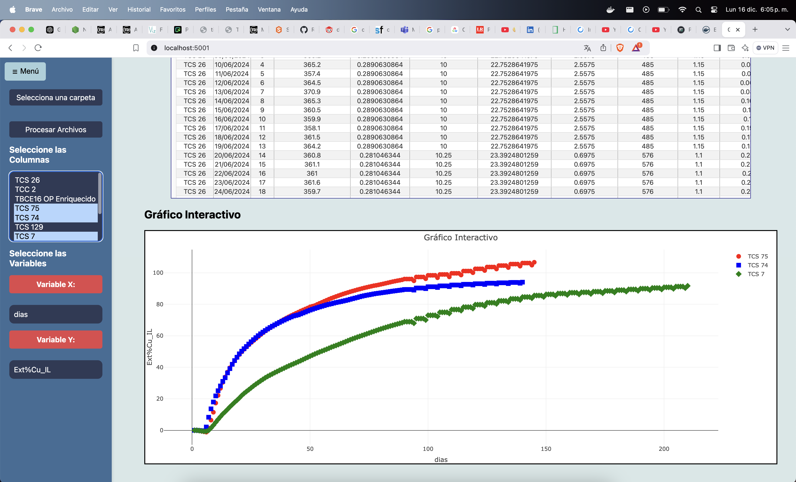

# Report_Columnas
Proyecto de aplicación de Visualización de datos de lixiviación de cobre en columnas.

---

### Tecnologías Usadas
- **Frontend**: HTML, CSS y JavaScript
- **Backend**: Python
- **Herramientas**: Docker y GitHub
  
---

### 📊 Visualización de Datos

